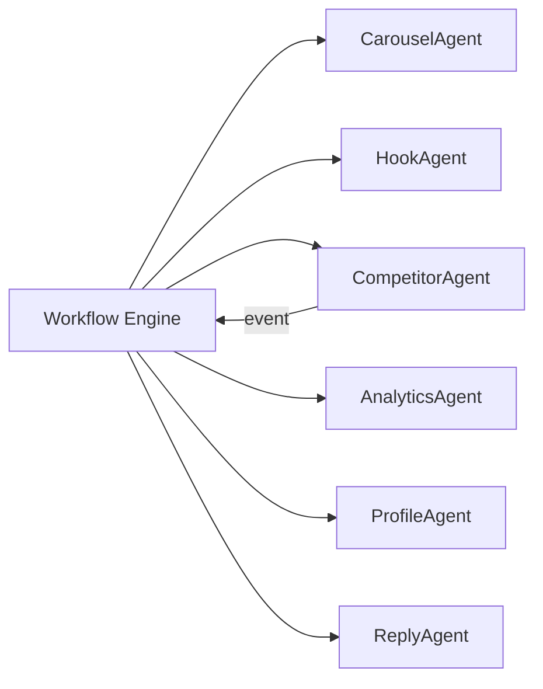

# AI Agents & Coding Workflow

**Repository:** LinkedIn PBOS (Personal Branding Operating System)  
**Audience:** Human engineers and AI coding assistants (Cursor, Copilot, etc.)  
**Companion doc:** [PROJECT_ARCHITECTURE.md](./PROJECT_ARCHITECTURE.md)  
**Version:** 1.0  
**Last updated:** 2026-05-19

---

## Table of Contents

1. [Purpose](#1-purpose)
2. [Architecture Rules (Non-Negotiable)](#2-architecture-rules-non-negotiable)
3. [Layer Responsibilities](#3-layer-responsibilities)
4. [Agent Catalog](#4-agent-catalog)
5. [Folder Conventions](#5-folder-conventions)
6. [Naming Conventions](#6-naming-conventions)
7. [Queue Rules](#7-queue-rules)
8. [Prompt Engineering Rules](#8-prompt-engineering-rules)
9. [Memory System Rules](#9-memory-system-rules)
10. [API Design Standards](#10-api-design-standards)
11. [AI Assistant Workflow](#11-ai-assistant-workflow)
12. [Checklist Before Opening a PR](#12-checklist-before-opening-a-pr)

---

## 1. Purpose

This document defines **how to build and extend AI agents** in this codebase. It is the contract for:

- Where agent code lives and how it is isolated
- How async work flows through Redis queues
- How prompts, memory, and LLM providers are wired
- What each named agent owns—and what it must **not** own

When implementing features, **read this file and PROJECT_ARCHITECTURE.md first**. Do not invent parallel patterns.

---

## 2. Architecture Rules (Non-Negotiable)

| Rule | Requirement |
|------|-------------|
| Thin controllers | Controllers validate input, authorize, dispatch jobs/actions, return resources. **No business rules.** |
| Service layer | All orchestration and domain logic lives in `*Service` classes under the owning domain. |
| Repositories | All Eloquent/query logic lives in `*Repository` classes. Services never call `Model::query()` directly. |
| Modular AI | LLM access only through `LlmGateway`. Prompts only through `PromptTemplateRegistry`. No inline prompts in agents. |
| Async by default | AI, scraping, publishing, rollups, and agent runs **must** use queued jobs unless explicitly synchronous (rare). |
| Agent isolation | Each agent is a separate class + config + prompt set. Agents do not import each other. |
| Reusable prompts | Prompts are versioned templates in DB/files—never duplicated as string literals. |
| No duplicate logic | Shared behavior goes to domain services, traits, or `App\Domains\AI\Support`. |
| Dependency injection | Constructor injection only; bind interfaces in `AppServiceProvider` or domain providers. |

### Request vs async boundary

```
HTTP Request → Controller → Action/Service → Repository
                    ↓
              Dispatch Job (queue)
                    ↓
              Job → AgentRunner → ConcreteAgent → Services → LlmGateway
```

**Never** call an agent or `LlmGateway` from a controller on the hot path for operations expected to exceed **500ms**.

---

## 3. Layer Responsibilities

### 3.1 Controller

```php
// ✅ Allowed
public function store(StoreHookRequest $request, ScoreHooksAction $action): JsonResponse
{
    $this->authorize('update', $request->contentItem());

    $run = $action->execute(
        workspace: $request->workspace(),
        contentVersionId: $request->validated('content_version_id'),
    );

    return HookRunResource::make($run)->response()->setStatusCode(202);
}

// ❌ Forbidden: scoring logic, LLM calls, DB queries
```

### 3.2 Action (optional thin orchestrator)

Single public method `execute(...)` for one use case. Delegates to services. Used when multiple services must coordinate atomically.

### 3.3 Service

- Enforces business rules and invariants
- Composes repositories and infrastructure (gateway, cache)
- Emits domain events
- **Does not** know about HTTP

### 3.4 Repository

- CRUD and scoped queries for one aggregate
- Returns models, DTOs, or collections
- **Does not** call LLMs or dispatch jobs

### 3.5 Agent

- Implements a **bounded autonomous task** (research, score, draft, analyze)
- Uses tools via `AgentToolRegistry` (never raw HTTP/DB in agent class)
- Persists run state through `AgentRunRepository`
- **Does not** own cross-domain persistence logic—delegates to services

### 3.6 Job

- Serializable entry point for queue workers
- Resolves agent/service from container, handles retries/idempotency
- **Does not** contain prompt text or scoring rubrics

---

## 4. Agent Catalog

All agents live under `App\Domains\Agents\Agents\{AgentName}\`.  
Each agent implements `AgentContract`:

```php
interface AgentContract
{
    public function slug(): string;
    public function run(AgentContext $context): AgentResult;
}
```

Shared orchestration: `AgentRunner` (queue job) → agent → tools → `AgentResult`.

| Agent | Slug | Queue | Primary domain |
|-------|------|-------|----------------|
| HookAgent | `hook` | `ai` | Content |
| ProfileAgent | `profile` | `ai` | Brand |
| AnalyticsAgent | `analytics` | `analytics` | Analytics |
| CompetitorAgent | `competitor` | `scrape` + `ai` | Intelligence |
| ReplyAgent | `reply` | `ai` | Content |
| CarouselAgent | `carousel` | `ai` | Content |

---

### 4.1 HookAgent

**Purpose:** Score, rank, and generate opening-line variants for posts (Hook Lab).

| Owns | Does not own |
|------|----------------|
| Hook dimension scoring (curiosity, clarity, specificity, audience fit) | Full post body generation (use Content services) |
| Top-N hook variant generation | Publishing or scheduling |
| Structured `HookScore` output | Competitor research |
| Prompt: `hook_scorer`, `hook_variant_generator` | Analytics rollups |

**Inputs (`AgentContext`):**

- `workspace_id`, `content_version_id`
- Optional: `target_audience`, `content_pillar`, `max_variants` (default 3)

**Outputs (`AgentResult`):**

- `hook_scores` record(s) linked to `content_version_id`
- `variants[]` with text + per-dimension scores
- `suggestions[]` (actionable edits)
- `trace_id` for observability

**Tools allowed:**

- `search_memory` (voice, anti-patterns, top-performing hooks)
- `get_content_version`
- `score_hooks` (internal—calls `HookScoringService` + `LlmGateway`)

**Services used:**

- `HookScoringService`
- `ContentVersionRepository`
- `MemoryRetrievalService`

**Events emitted:**

- `HookScored`

**Typical trigger:** User clicks "Score hooks" → `RunHookAgentJob` on `ai` queue.

---

### 4.2 ProfileAgent

**Purpose:** Analyze and optimize LinkedIn profile sections (headline, about, featured, skills).

| Owns | Does not own |
|------|----------------|
| Section-level analysis and rewrite proposals | Playwright login/session management |
| Before/after scoring against brand voice | Live profile apply (user confirms in UI) |
| Keyword and positioning recommendations | Competitor post analysis |
| Prompt: `profile_optimizer`, `profile_scorer` | General content drafting |

**Inputs:**

- `workspace_id`, `linkedin_account_id`
- `sections[]` (e.g. `headline`, `about`)
- Current text from DB or latest scrape snapshot

**Outputs:**

- `profile_optimizations` rows per section
- `score` + `rationale` + `suggested_text`
- Citations to memory chunks used

**Tools allowed:**

- `search_memory` (facts, offers, voice)
- `get_profile_snapshot`
- `get_brand_profile`

**Services used:**

- `ProfileOptimizationService`
- `BrandProfileRepository`
- `LinkedInProfileSnapshotRepository`

**Events emitted:**

- `ProfileOptimizationProposed`

**Typical trigger:** User opens Profile Optimizer → `RunProfileAgentJob` on `ai` queue.  
If snapshot stale (>7d), orchestrator first dispatches scrape job, then chains agent job.

---

### 4.3 AnalyticsAgent

**Purpose:** Turn metrics into **insights and recommendations**—not raw data collection.

| Owns | Does not own |
|------|----------------|
| Natural-language insight generation | Event ingestion (Analytics processors) |
| Posting time / format recommendations | Playwright metric scraping |
| Weekly performance summaries | Dashboard chart rendering (Next.js) |
| Anomaly explanations ("engagement dropped 30%") | Hook variant generation |
| Prompt: `analytics_insights`, `analytics_recommendations` | Competitor snapshot capture |

**Inputs:**

- `workspace_id`, `date_range`, `metric_scope` (`posts`, `profile`, `competitors_summary`)
- Pre-aggregated rollups from `analytics_daily_rollups` (never raw event scans in agent)

**Outputs:**

- `insights[]` with `type`, `confidence`, `evidence`, `recommended_action`
- Optional persisted `analytics_insights` records

**Tools allowed:**

- `get_daily_rollups`
- `get_top_posts`
- `search_memory` (performance-type chunks only)
- `get_brand_profile`

**Services used:**

- `AnalyticsInsightService`
- `AnalyticsRollupRepository`
- `MemoryRetrievalService` (filtered by `type=performance`)

**Events emitted:**

- `AnalyticsInsightGenerated`

**Typical trigger:** Cron `analytics:generate-insights` → `RunAnalyticsAgentJob` on `analytics` queue.

---

### 4.4 CompetitorAgent

**Purpose:** Monitor competitors, diff snapshots, surface strategic alerts and content gaps.

| Owns | Does not own |
|------|----------------|
| Snapshot diff interpretation | Playwright scrape implementation (`ScrapeCompetitorJob`) |
| Topic/positioning shift summaries | Hook scoring |
| Content gap suggestions vs brand pillars | Direct publishing |
| Alert payload for UI/notifications | Full carousel layout |
| Prompt: `competitor_diff`, `competitor_gap_analysis` | Profile section rewrites |

**Inputs:**

- `workspace_id`, `competitor_id`
- `previous_snapshot_id`, `current_snapshot_id` (or latest two)

**Outputs:**

- `competitor_alerts[]` (severity, title, body, evidence)
- Optional `memory_chunks` candidate for `type=performance` (competitor patterns)
- `AgentResult.summary` for workflow consumption

**Tools allowed:**

- `get_competitor_snapshots`
- `search_memory`
- `list_brand_pillars`
- `enqueue_scrape` (dispatches job—does not scrape inline)

**Services used:**

- `CompetitorDiffService`
- `CompetitorSnapshotRepository`
- `IntelligenceAlertService`

**Events emitted:**

- `CompetitorAlertRaised`
- `CompetitorSnapshotCaptured` (consumer, not producer)

**Typical trigger:** `CompetitorSnapshotCaptured` event → `RunCompetitorAgentJob` on `ai` queue.  
Scrape always on `scrape` queue first.

---

### 4.5 ReplyAgent

**Purpose:** Draft thoughtful comment replies aligned with brand voice and thread context.

| Owns | Does not own |
|------|----------------|
| Reply drafts for comments on posts | Posting replies via automation (v1: copy-only unless policy allows) |
| Tone guardrails and length control | Original post creation |
| Thread context summarization | Competitor monitoring |
| Prompt: `reply_drafter`, `reply_triage` (short vs thoughtful) | Analytics insights |

**Inputs:**

- `workspace_id`, `thread_context` (post text, parent comments, author metadata)
- `reply_intent` (`support`, `insight`, `question`, `cta_soft`)
- Optional `content_item_id` if replying on own post

**Outputs:**

- `reply_drafts[]` with `text`, `tone`, `risk_flags[]`
- Never auto-posts without `workspace.settings.auto_reply_enabled`

**Tools allowed:**

- `search_memory`
- `get_brand_profile`
- `moderate_content` (safety pass)

**Services used:**

- `ReplyDraftService`
- `ContentModerationService`
- `MemoryRetrievalService`

**Events emitted:**

- `ReplyDraftCreated`

**Typical trigger:** User requests reply suggestions → `RunReplyAgentJob` on `ai` queue.

---

### 4.6 CarouselAgent

**Purpose:** Generate multi-slide carousel structure, copy, and design hints.

| Owns | Does not own |
|------|----------------|
| Slide outline (title, bullets, CTA slide) | Image rendering/export (future service) |
| Per-slide hook lines | Hook Lab dimension scoring (delegate to HookAgent via workflow) |
| Carousel narrative arc | Profile optimization |
| Prompt: `carousel_planner`, `carousel_slide_writer` | Scheduling |

**Inputs:**

- `workspace_id`, `topic`, `slide_count` (default 8–10)
- Optional: `source_content_version_id` (repurpose from post)
- Brand pillars and memory context

**Outputs:**

- `content_item` with `type=carousel`
- `content_version` with `slides[]` JSON schema:

```json
{
  "slides": [
    { "index": 1, "headline": "", "body": "", "speaker_notes": "" }
  ]
}
```

**Tools allowed:**

- `search_memory`
- `get_content_version`
- `create_content_draft` (via `ContentDraftService`—structured slides only)

**Services used:**

- `CarouselDraftService`
- `ContentItemRepository`
- `MemoryRetrievalService`

**Events emitted:**

- `CarouselDraftCreated`

**Typical trigger:** User creates carousel → `RunCarouselAgentJob` on `ai` queue.  
Workflows may chain `CarouselAgent` → `HookAgent` (score slide 1 hook only).

---

### 4.7 Agent interaction matrix

Agents **must not** call each other directly. Orchestration happens via:

1. **Workflow engine** (`App\Domains\Workflows`) — preferred for multi-step flows
2. **Domain events + listeners** — loose coupling
3. **Explicit job chains** — only when workflow DSL is overkill



---

## 5. Folder Conventions

### 5.1 Laravel (`apps/api`)

```
app/Domains/
├── Agents/
│   ├── Contracts/
│   │   ├── AgentContract.php
│   │   ├── AgentToolContract.php
│   │   └── AgentResult.php
│   ├── Agents/
│   │   ├── HookAgent/
│   │   │   ├── HookAgent.php
│   │   │   ├── HookAgentConfig.php
│   │   │   └── Tools/
│   │   ├── ProfileAgent/
│   │   ├── AnalyticsAgent/
│   │   ├── CompetitorAgent/
│   │   ├── ReplyAgent/
│   │   └── CarouselAgent/
│   ├── Services/
│   │   ├── AgentRunner.php
│   │   ├── AgentToolRegistry.php
│   │   └── AgentRunService.php
│   ├── Jobs/
│   │   └── RunAgentJob.php          # Single entry job; slug in payload
│   ├── Repositories/
│   │   ├── AgentRunRepository.php
│   │   └── AgentStepRepository.php
│   └── Events/
├── AI/
│   ├── Contracts/LlmGateway.php
│   ├── Services/
│   │   ├── LlmGateway.php
│   │   ├── PromptTemplateRegistry.php
│   │   ├── MemoryRetrievalService.php
│   │   └── TokenBudgetService.php
│   ├── Adapters/
│   │   ├── OpenAiAdapter.php
│   │   └── GeminiAdapter.php
│   └── Support/
├── Content/          # HookScoringService, CarouselDraftService, etc.
├── Brand/            # ProfileOptimizationService
├── Analytics/        # AnalyticsInsightService
└── Intelligence/     # CompetitorDiffService
```

### 5.2 Prompt templates

```
resources/prompts/
├── hook/
│   ├── scorer/v1.blade.php
│   └── variant_generator/v1.blade.php
├── profile/
├── analytics/
├── competitor/
├── reply/
└── carousel/
```

Registered in DB `prompt_templates` for runtime version pinning.

### 5.3 Next.js (`apps/web`)

- **No agent logic in frontend.** UI triggers API endpoints only.
- Agent progress: subscribe via WebSocket channel `workspace.{id}.agent.{runId}`.
- Types from OpenAPI—never hand-roll agent result shapes.

---

## 6. Naming Conventions

### 6.1 PHP classes

| Artifact | Pattern | Example |
|----------|---------|---------|
| Agent | `{Purpose}Agent` | `HookAgent` |
| Agent config | `{Purpose}AgentConfig` | `HookAgentConfig` |
| Agent job | `Run{Purpose}AgentJob` | `RunHookAgentJob` |
| Service | `{Noun}{Verb}Service` | `HookScoringService` |
| Repository | `{Model}Repository` | `AgentRunRepository` |
| Action | `{Verb}{Noun}Action` | `ScoreHooksAction` |
| Request | `{Verb}{Noun}Request` | `StoreHookScoreRequest` |
| Resource | `{Noun}Resource` | `HookRunResource` |
| Event | `{Noun}{PastTense}` | `HookScored` |
| Tool | `{verb}_{noun}` slug | `search_memory` |

### 6.2 Database & API

| Item | Convention |
|------|------------|
| Tables | snake_case plural | `agent_runs` |
| Columns | snake_case | `workspace_id` |
| API routes | kebab-case plural | `/api/v1/hook-runs` |
| JSON fields | snake_case | `content_version_id` |
| Enums (PHP) | PascalCase cases | `AgentRunStatus::Running` |

### 6.3 Agent slugs

Fixed slugs—do not invent synonyms:

`hook` | `profile` | `analytics` | `competitor` | `reply` | `carousel`

### 6.4 Redis keys

`{env}:pbos:{workspace_id}:agent:run:{run_id}`  
`{env}:pbos:{workspace_id}:memory:version`

---

## 7. Queue Rules

### 7.1 Queue assignment

| Queue | Jobs |
|-------|------|
| `critical` | Publish, billing webhooks |
| `ai` | All `Run*AgentJob` except AnalyticsAgent |
| `scrape` | Playwright jobs only |
| `analytics` | `RunAnalyticsAgentJob`, rollups |
| `default` | Email, cleanup |

### 7.2 Job standards

Every job must:

1. Implement `ShouldQueue`
2. Set `$queue` explicitly in constructor or via `onQueue()`
3. Use `workspace_id` in constructor for Horizon tagging
4. Define `$tries`, `$backoff`, and `failed()` handler
5. Be **idempotent** via `idempotency_key` or status check on `agent_runs`

```php
final class RunHookAgentJob implements ShouldQueue
{
    public int $tries = 3;
    public array $backoff = [10, 60, 300];

    public function __construct(
        public readonly string $workspaceId,
        public readonly string $agentRunId,
    ) {
        $this->onQueue('ai');
    }

    public function handle(AgentRunner $runner): void
    {
        $runner->run(slug: 'hook', runId: $this->agentRunId);
    }
}
```

### 7.3 Chaining & workflows

| Pattern | When to use |
|---------|-------------|
| `Bus::chain()` | Fixed sequence, same bounded context |
| Domain event → listener | Scrape complete → CompetitorAgent |
| Workflow DAG | Multi-agent + human approval gates |

**Never** chain more than 5 jobs without a `workflow_run` record.

### 7.4 Timeouts

| Queue | Timeout |
|-------|---------|
| `ai` | 120s |
| `scrape` | 180s |
| `analytics` | 90s |

### 7.5 Horizon tags

Tag all agent jobs: `workspace:{id}`, `agent:{slug}`, `run:{run_id}` for filtering and rate limits.

---

## 8. Prompt Engineering Rules

### 8.1 Golden rules

1. **Prompts live in template files only** — `resources/prompts/{domain}/{name}/v{n}.blade.php`
2. **Version every change** — bump `v2`, register in `prompt_templates`, never overwrite `v1` in place
3. **Variables are explicit** — document in template header comment; validate in `PromptRenderer`
4. **Structured output** — use JSON schema / `response_format` for scores, slides, insights
5. **System vs user separation** — brand voice + policies in system; task specifics in user
6. **Cite memory** — instruct model to reference `[mem:{id}]` when using RAG chunks
7. **No secrets in prompts** — never embed API keys, cookies, or PII

### 8.2 Template structure

```blade
{{-- prompt: hook.scorer v1 --}}
{{-- variables: @var array $brand_voice @var string $draft_text @var array $memory_chunks --}}

## Role
You are Hook Lab, an expert at LinkedIn opening lines.

## Brand voice
@include('prompts.partials.brand_voice', ['voice' => $brand_voice])

## Memory context
@include('prompts.partials.memory_citations', ['chunks' => $memory_chunks])

## Task
Score the opening line (first 2 lines) of the draft below.
Return JSON matching schema: hook_score_v1

## Draft
{{ $draft_text }}
```

### 8.3 Rendering flow

```
PromptTemplateRegistry::resolve('hook.scorer', version: 'v1')
    → PromptRenderer::render(variables)
    → LlmGateway::complete(LlmRequest)
    → StructuredOutputValidator::validate(schema)
```

### 8.4 Model selection

| Task type | Default model | Fallback |
|-----------|---------------|----------|
| Scoring / classification | Fast/cheap | — |
| Long-form draft | Quality tier | Alternate provider |
| Embeddings | Embedding model | — |

Configure per template in `prompt_templates.config_json`, not hardcoded in agents.

### 8.5 Prohibited

- Copy-pasting prompts between agents (extract partials)
- Prompts in Next.js or controllers
- Unbounded `max_tokens` (set per template)
- Sending full competitor HTML to LLM (summarize in service first)

---

## 9. Memory System Rules

### 9.1 Retrieval

- All agents use `MemoryRetrievalService` — **never** query `memory_chunks` directly
- Every retrieval scoped by `workspace_id` + pinned `memory_version`
- Filter by `type` when agent scope is narrow (e.g. AnalyticsAgent → `performance` only)

### 9.2 Writing memory

| Agent | May write memory? | Type |
|-------|-------------------|------|
| HookAgent | No | — |
| ProfileAgent | No | — |
| AnalyticsAgent | Yes (optional) | `performance` insights |
| CompetitorAgent | Yes (optional) | `performance` patterns |
| ReplyAgent | No | — |
| CarouselAgent | No | — |

Writes go through `MemoryIngestionService` — agents call a tool, not repository directly.

### 9.3 Chunk rules

- 300–800 tokens per chunk; overlap 50 tokens
- `content` is plain text; metadata in columns, not buried in content
- Supersede contradictions—do not delete facts without `superseded_by_chunk_id`

### 9.4 RAG in agents

```php
$chunks = $this->memoryRetrieval->retrieve(
    workspaceId: $context->workspaceId,
    query: $context->input('topic'),
    types: ['voice', 'facts', 'anti_patterns'],
    limit: 5,
);
```

Include `chunk_ids` in `agent_steps.payload` for audit.

---

## 10. API Design Standards

### 10.1 Agent run endpoints

| Method | Path | Behavior |
|--------|------|----------|
| `POST` | `/api/v1/agents/{slug}/runs` | Create run, dispatch job, return `202` |
| `GET` | `/api/v1/agents/runs/{id}` | Poll status + result |
| `GET` | `/api/v1/agents/runs` | List runs (paginated, filter by slug) |
| `DELETE` | `/api/v1/agents/runs/{id}` | Cancel if `queued` or `running` |

### 10.2 Request shape

```json
{
  "input": {
    "content_version_id": "cv_123"
  },
  "options": {
    "max_variants": 3
  }
}
```

Validation via Form Request; map to `AgentContext` DTO in action.

### 10.3 Response shape

```json
{
  "data": {
    "id": "ar_456",
    "slug": "hook",
    "status": "queued",
    "created_at": "2026-05-19T12:00:00Z"
  }
}
```

Completed run:

```json
{
  "data": {
    "id": "ar_456",
    "status": "completed",
    "output": { },
    "trace_id": "tr_789",
    "completed_at": "2026-05-19T12:00:15Z"
  }
}
```

### 10.4 Errors

| Code | When |
|------|------|
| `202` | Run accepted |
| `402` | Token budget exceeded |
| `409` | Duplicate idempotency key |
| `422` | Validation failure |
| `503` | LLM provider circuit open |

Use RFC 7807 problem+json for errors.

### 10.5 Headers

| Header | Required |
|--------|----------|
| `X-Workspace-Id` | Yes (or derived from route) |
| `Idempotency-Key` | Recommended on `POST` |
| `Accept` | `application/json` |

### 10.6 Domain-specific shortcuts

Convenience routes wrap generic agent runs:

| Route | Delegates to |
|-------|----------------|
| `POST /api/v1/content/{id}/hooks/score` | `hook` agent |
| `POST /api/v1/profile/optimize` | `profile` agent |
| `POST /api/v1/carousels` | `carousel` agent |
| `POST /api/v1/replies/draft` | `reply` agent |

Implementation: controller → action → `AgentRunService::dispatch('hook', ...)`.

---

## 11. AI Assistant Workflow

When an AI coding assistant implements a feature in this repo, follow this sequence:

### Step 1 — Scope

1. Identify bounded context (`Content`, `Brand`, `Agents`, etc.)
2. Confirm if work needs a new agent or extends an existing one
3. Check [Agent Catalog](#4-agent-catalog) for ownership boundaries

### Step 2 — Design

1. List files to create/modify (controller, request, action, service, repository, job, agent)
2. Confirm async path (queue name, events)
3. Identify prompt template slug + version (do not inline)

### Step 3 — Implement (order)

1. Migration / model (if needed)
2. Repository methods
3. Service logic
4. Prompt template + registry entry
5. Agent class + tools
6. Job + event/listener
7. Controller + request + resource
8. Feature test (HTTP + job fake)
9. OpenAPI annotation or schema update

### Step 4 — Verify

- No LLM calls in controller or repository
- No cross-agent imports
- Job on correct queue with tags
- `workspace_id` scoped everywhere
- Prompt version registered

### Step 5 — Document

- Update this file if agent responsibilities change
- Update `PROJECT_ARCHITECTURE.md` for cross-cutting architectural shifts only

---

## 12. Checklist Before Opening a PR

- [ ] Controller delegates to action/service; no business logic
- [ ] Database access only in repositories
- [ ] LLM access only via `LlmGateway`
- [ ] Prompts in `resources/prompts/` with version bump if changed
- [ ] Agent isolated under `Agents/{Name}Agent/`
- [ ] Async work dispatched to correct queue
- [ ] `agent_runs` + `agent_steps` persisted for observability
- [ ] `workspace_id` enforced in policies and queries
- [ ] Idempotency considered for job retries
- [ ] Feature tests cover happy path + authorization failure
- [ ] No duplicate logic—shared code extracted to domain service
- [ ] OpenAPI / frontend types updated if API changed

---

## Appendix: Quick Reference

### Add a new tool (shared across agents)

1. Create `App\Domains\Agents\Tools\{ToolName}Tool` implementing `AgentToolContract`
2. Register in `AgentToolRegistry`
3. Add unit test with mocked dependencies

### Add a new agent

1. Create folder `Agents/{Name}Agent/`
2. Implement `AgentContract` + config
3. Register slug in `config/agents.php`
4. Add `Run{Name}AgentJob`
5. Add prompt templates under `resources/prompts/{name}/`
6. Document in [Agent Catalog](#4-agent-catalog)
7. Add `POST /api/v1/agents/{slug}/runs` support (generic route may suffice)

### Related docs

- [PROJECT_ARCHITECTURE.md](./PROJECT_ARCHITECTURE.md) — system design, infra, data model
- `docs/api/openapi.yaml` — HTTP contract (when present)
- `docs/runbooks/` — operational playbooks (when present)

---

## Document History

| Version | Date | Changes |
|---------|------|---------|
| 1.0 | 2026-05-19 | Initial agent catalog and coding workflow |
