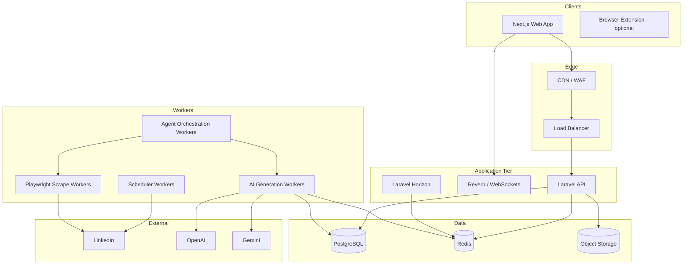
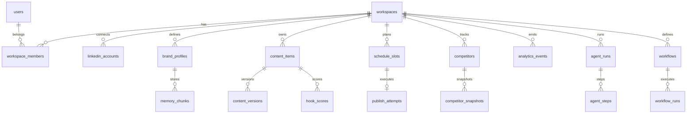
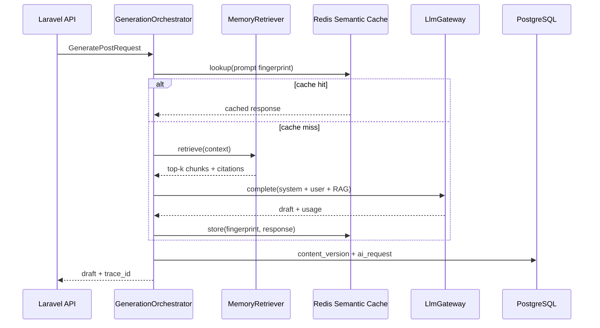
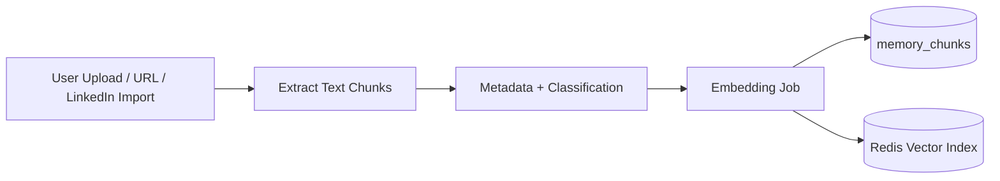
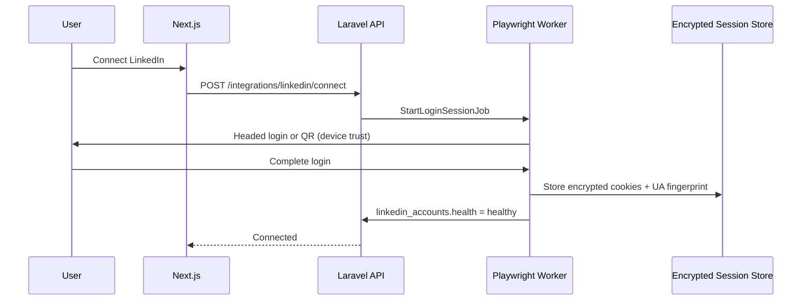
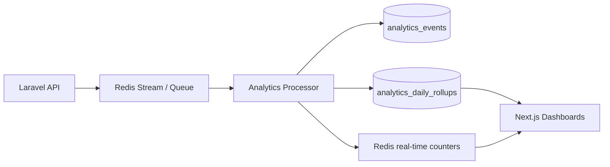
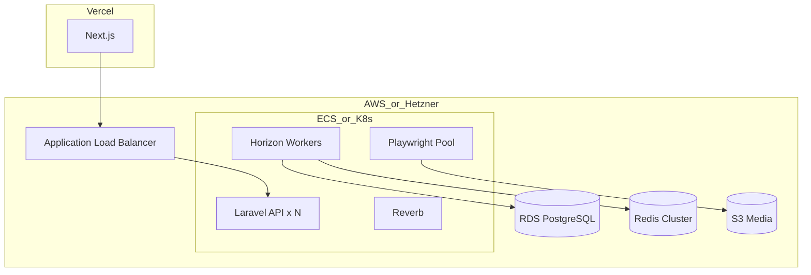

# Project Architecture

**Product:** AI-Powered Personal Branding Operating System (PBOS)  
**Primary surface:** LinkedIn growth optimization  
**Document version:** 1.0  
**Last updated:** 2026-05-19  
**Status:** Target architecture (greenfield)

---

## Table of Contents

1. [System Overview](#1-system-overview)
2. [Service Architecture](#2-service-architecture)
3. [Database Design](#3-database-design)
4. [Queue & Event Workflow](#4-queue--event-workflow)
5. [AI Pipeline](#5-ai-pipeline)
6. [Memory System](#6-memory-system)
7. [LinkedIn Integration Flow](#7-linkedin-integration-flow)
8. [Analytics Architecture](#8-analytics-architecture)
9. [Deployment Architecture](#9-deployment-architecture)
10. [Folder Structure](#10-folder-structure)
11. [Security Considerations](#11-security-considerations)
12. [Scaling Strategy](#12-scaling-strategy)

---

## 1. System Overview

### 1.1 Purpose

PBOS is a multi-tenant SaaS platform that helps professionals and teams **plan, create, optimize, schedule, and measure** LinkedIn presence as a repeatable operating system—not a one-off content tool.

Core capabilities map to product modules:

| Module | Responsibility |
|--------|----------------|
| **Content Studio** | AI-assisted posts, carousels, comments, repurposing |
| **Hook Lab** | Hook scoring, A/B variants, pattern libraries |
| **Scheduler** | Calendar, queues, timezone-aware publishing |
| **Analytics** | Post/profile/competitor metrics, trends, recommendations |
| **Agents** | Autonomous research, drafting, review, competitor monitoring |
| **Workflows** | Durable multi-step automations (approval → generate → schedule) |
| **Competitor Intel** | Track rivals, diff positioning, alert on moves |
| **Brand Memory** | Long-lived voice, facts, pillars, anti-patterns |
| **Profile Optimizer** | Headline/about/skills suggestions with before/after scoring |

### 1.2 Design Principles

- **API-first:** Laravel exposes versioned REST + webhooks; Next.js is a thin, typed client.
- **Event-driven core:** Side effects (AI, scraping, publishing) run asynchronously via queues.
- **Tenant isolation:** Row-level security by `workspace_id`; no cross-tenant data paths.
- **Human-in-the-loop by default:** Agents propose; users approve unless policy allows auto-publish.
- **Observable AI:** Every generation stores prompt hash, model, tokens, retrieval context, and user feedback.
- **Graceful degradation:** If LinkedIn automation is blocked, fall back to copy-to-clipboard + manual publish tracking.

### 1.3 High-Level Context Diagram



### 1.4 Request Lifecycle (Typical)

1. User authenticates (Sanctum session or token).
2. Next.js calls Laravel API with workspace context header.
3. Read paths hit PostgreSQL (+ Redis cache); heavy writes enqueue jobs.
4. Workers execute AI/scrape/publish; progress streams via WebSockets or polling.
5. Analytics pipeline ingests events; dashboards read pre-aggregated tables.

---

## 2. Service Architecture

### 2.1 Logical Services

PBOS is deployed as a **modular monolith** (Laravel) with **clear bounded contexts**. Extract to microservices only when independent scaling or team ownership demands it.

| Bounded Context | Laravel Namespace | Primary Responsibilities |
|-----------------|-------------------|--------------------------|
| **Identity & Billing** | `App\Domains\Identity` | Users, workspaces, roles, plans, Stripe |
| **Brand** | `App\Domains\Brand` | Voice, pillars, memory, profile assets |
| **Content** | `App\Domains\Content` | Drafts, versions, hooks, templates |
| **Schedule** | `App\Domains\Schedule` | Slots, publish jobs, retries |
| **Analytics** | `App\Domains\Analytics` | Events, rollups, insights |
| **Intelligence** | `App\Domains\Intelligence` | Competitors, scrape targets, diffs |
| **AI** | `App\Domains\AI` | Providers, prompts, RAG, evals |
| **Agents** | `App\Domains\Agents` | Agent definitions, runs, tool calls |
| **Workflows** | `App\Domains\Workflows` | DAG definitions, step execution |
| **Integrations** | `App\Domains\Integrations` | LinkedIn sessions, Playwright fleet |

### 2.2 API Surface

| Layer | Technology | Notes |
|-------|------------|-------|
| Public API | Laravel 11+ routes (`/api/v1/*`) | JSON, OpenAPI spec generated |
| Auth | Laravel Sanctum + workspace middleware | SPA cookie + optional API tokens |
| Real-time | Laravel Reverb or Pusher-compatible | Job progress, agent streaming |
| Admin | Filament or internal Next route | Feature flags, tenant support |

**Versioning:** URI prefix `/api/v1`. Breaking changes require `/api/v2`.

### 2.3 Next.js Frontend Architecture

| Concern | Pattern |
|---------|---------|
| Routing | App Router (`app/`) with route groups per workspace |
| Data fetching | Server Components for SSR shell; TanStack Query for client mutations |
| API client | Generated types from OpenAPI (`openapi-typescript`) |
| State | URL state + React Query cache; Zustand only for ephemeral UI |
| Auth | HttpOnly cookies; middleware protects `(dashboard)` routes |
| Streaming AI | SSE endpoint proxy or direct WebSocket subscription |

### 2.4 Redis Responsibilities

| Use Case | Structure | TTL / Policy |
|----------|-----------|--------------|
| Session / Sanctum metadata | Hash | Session lifetime |
| Rate limits | String counters | 1m–24h windows |
| Job queues | Lists / Horizon meta | Managed by Horizon |
| Semantic cache (LLM) | Vector index + JSON | 24h–7d by prompt class |
| Brand memory hot cache | Hash per workspace | 1h, invalidate on write |
| Scheduler locks | String `SET NX` | Slot duration |
| Analytics real-time counters | HyperLogLog / INCR | 48h rolling |
| Pub/Sub progress | Channels | Ephemeral |

**Key naming convention:** `{env}:{service}:{tenant}:{entity}:{id}`  
Example: `prod:pbos:ws_abc:brand_memory:chunk_42`

### 2.5 Playwright Worker Fleet

Playwright runs in **isolated worker containers**, not in the web request path.

- One browser context per LinkedIn account (sticky session).
- Session cookies encrypted at rest; loaded into context per job.
- Concurrency capped per workspace plan (e.g. 1–3 contexts).
- Headless Chromium with hardened flags; no arbitrary URL navigation except allowlist.

---

## 3. Database Design

### 3.1 PostgreSQL Conventions

- **Primary keys:** `bigint` identity or UUIDv7 for time-ordered IDs.
- **Multi-tenancy:** `workspace_id` on all tenant tables; composite indexes lead with `workspace_id`.
- **Soft deletes:** `deleted_at` on user-facing entities.
- **Audit:** `created_at`, `updated_at`; sensitive tables add `created_by`.
- **JSONB:** Flexible metadata; indexed with GIN only when queried.

### 3.2 Entity Relationship (Core)



### 3.3 Table Reference

#### Identity & Billing

| Table | Key Columns | Purpose |
|-------|-------------|---------|
| `users` | `id`, `email`, `password_hash`, `name` | Platform users |
| `workspaces` | `id`, `name`, `slug`, `plan_id`, `settings` | Tenant boundary |
| `workspace_members` | `workspace_id`, `user_id`, `role` | RBAC membership |
| `subscriptions` | `workspace_id`, `stripe_*`, `status` | Billing state |

#### Brand & Memory

| Table | Key Columns | Purpose |
|-------|-------------|---------|
| `brand_profiles` | `workspace_id`, `voice_json`, `pillars`, `constraints` | Canonical brand definition |
| `memory_chunks` | `workspace_id`, `type`, `content`, `embedding_id`, `source` | RAG chunks (facts, stories, offers) |
| `memory_sources` | `workspace_id`, `kind`, `uri`, `last_ingested_at` | Docs, URLs, uploads feeding memory |
| `profile_optimizations` | `linkedin_account_id`, `section`, `before`, `after`, `score` | Profile edit history |

#### Content & Hooks

| Table | Key Columns | Purpose |
|-------|-------------|---------|
| `content_items` | `workspace_id`, `type`, `status`, `scheduled_at` | Post/carousel/comment unit |
| `content_versions` | `content_item_id`, `body`, `metadata`, `author` | Immutable versions |
| `hook_scores` | `content_version_id`, `score`, `dimensions_json`, `model` | Hook Lab results |
| `content_templates` | `workspace_id`, `name`, `structure_json` | Reusable patterns |

#### Scheduling & Publishing

| Table | Key Columns | Purpose |
|-------|-------------|---------|
| `schedule_slots` | `workspace_id`, `content_item_id`, `publish_at`, `timezone` | Calendar slots |
| `publish_attempts` | `schedule_slot_id`, `status`, `error`, `linkedin_urn` | Execution audit |
| `linkedin_accounts` | `workspace_id`, `profile_urn`, `session_ref`, `health_status` | Connected identities |

#### Intelligence & Analytics

| Table | Key Columns | Purpose |
|-------|-------------|---------|
| `competitors` | `workspace_id`, `linkedin_url`, `labels` | Tracked profiles |
| `competitor_snapshots` | `competitor_id`, `captured_at`, `payload_json` | Point-in-time scrape |
| `analytics_events` | `workspace_id`, `event_type`, `entity_type`, `entity_id`, `properties` | Raw event stream |
| `analytics_daily_rollups` | `workspace_id`, `date`, `metric`, `value` | Dashboard aggregates |

#### AI, Agents & Workflows

| Table | Key Columns | Purpose |
|-------|-------------|---------|
| `ai_requests` | `workspace_id`, `provider`, `model`, `tokens`, `cost_usd`, `trace_id` | Cost & observability |
| `prompt_templates` | `slug`, `version`, `body`, `variables` | Managed prompts |
| `agent_definitions` | `workspace_id`, `config_json`, `tools` | Agent blueprints |
| `agent_runs` | `workspace_id`, `agent_definition_id`, `status`, `input`, `output` | Run records |
| `agent_steps` | `agent_run_id`, `step_type`, `payload`, `status` | Tool/LLM steps |
| `workflows` | `workspace_id`, `definition_json` | DAG spec |
| `workflow_runs` | `workflow_id`, `status`, `context_json` | Executions |

### 3.4 Indexing Strategy

```sql
-- Tenant-scoped list queries
CREATE INDEX idx_content_items_ws_status ON content_items (workspace_id, status, updated_at DESC);
CREATE INDEX idx_schedule_slots_ws_publish ON schedule_slots (workspace_id, publish_at) WHERE deleted_at IS NULL;
CREATE INDEX idx_analytics_events_ws_time ON analytics_events (workspace_id, created_at DESC);
CREATE INDEX idx_memory_chunks_ws_type ON memory_chunks (workspace_id, type);

-- Partial indexes for hot paths
CREATE INDEX idx_publish_attempts_pending ON publish_attempts (status) WHERE status IN ('queued', 'running');
```

### 3.5 Partitioning (Growth Phase)

When `analytics_events` exceeds ~50M rows/workspace-year:

- Partition by `created_at` monthly on `analytics_events`.
- Archive cold partitions to object storage (Parquet) for long-range BI.

---

## 4. Queue & Event Workflow

### 4.1 Queue Topology (Laravel Horizon)

| Queue | Priority | Workers | Typical Jobs |
|-------|----------|---------|--------------|
| `critical` | Highest | 2–4 | Publish now, payment webhooks |
| `ai` | High | 4–16 | Generation, hook scoring, embeddings |
| `scrape` | Medium | 2–8 | Playwright competitor/profile pulls |
| `schedule` | Medium | 2–4 | Slot dispatcher, retry publish |
| `analytics` | Low | 2–4 | Rollups, insight generation |
| `default` | Low | 2 | Email, cleanup |

**Retry policy:** Exponential backoff; max 5 attempts for publish; 3 for scrape; dead-letter to `failed_jobs` with alert.

### 4.2 Domain Events

| Event | Producers | Consumers |
|-------|-----------|-----------|
| `ContentDraftCreated` | Content API | Hook scoring job, workflow trigger |
| `HookScored` | Hook Lab worker | Notify UI, update content metadata |
| `ContentApproved` | User action | Schedule slot creation |
| `ScheduleSlotDue` | Scheduler cron | `PublishToLinkedInJob` |
| `PublishSucceeded` / `PublishFailed` | Publish worker | Analytics ingest, notifications |
| `CompetitorSnapshotCaptured` | Scrape worker | Diff job, agent alerts |
| `MemoryChunkIngested` | Ingestion pipeline | Embedding index update |
| `AgentRunCompleted` | Agent orchestrator | Workflow resume, webhook |

### 4.3 Workflow Orchestration Model

Workflows are **directed acyclic graphs (DAGs)** stored as JSON:

```json
{
  "id": "weekly-content-os",
  "steps": [
    { "id": "research", "type": "agent", "agent": "competitor_research" },
    { "id": "draft", "type": "agent", "agent": "content_drafter", "depends_on": ["research"] },
    { "id": "hooks", "type": "job", "job": "ScoreHooksJob", "depends_on": ["draft"] },
    { "id": "approve", "type": "human_gate", "depends_on": ["hooks"] },
    { "id": "schedule", "type": "job", "job": "CreateScheduleSlotJob", "depends_on": ["approve"] }
  ]
}
```

**Execution engine:**

1. `WorkflowRunStarted` loads context into Redis hash `workflow:run:{id}`.
2. Each completed step emits `WorkflowStepCompleted`; engine enqueues ready dependents.
3. Human gates set status `awaiting_approval` and notify UI.
4. Failures support compensating steps (e.g. cancel schedule slot).

### 4.4 Scheduler Cron

| Schedule | Command | Purpose |
|----------|---------|---------|
| Every minute | `schedule:dispatch-due-slots` | Enqueue publish jobs ± grace window |
| Every 15 min | `competitors:sync-due` | Queue scrape jobs per competitor cadence |
| Hourly | `analytics:rollup` | Daily/hourly aggregates |
| Daily | `ai:reconcile-usage` | Billing meter alignment |
| Daily | `sessions:health-check` | LinkedIn session validation |

---

## 5. AI Pipeline

### 5.1 Provider Abstraction

All LLM calls route through `App\Domains\AI\Services\LlmGateway`:

```php
interface LlmGateway {
    public function complete(LlmRequest $request): LlmResponse;
    public function embed(EmbedRequest $request): EmbedResponse;
    public function stream(LlmRequest $request): StreamedResponse;
}
```

Implementations: `OpenAiAdapter`, `GeminiAdapter` with unified:

- Token counting and cost attribution per `workspace_id`
- Timeout (30–120s by task class)
- Circuit breaker when provider error rate > threshold
- Automatic fallback: OpenAI ↔ Gemini per workspace policy

### 5.2 Generation Pipeline Stages



| Stage | Input | Output |
|-------|-------|--------|
| **Intent classification** | User prompt, content type | Task template selection |
| **Context assembly** | Brand profile + memory retrieval + competitor insights | `ContextBundle` |
| **Draft generation** | Bundle + constraints | Raw draft |
| **Hook optimization** | Draft + Hook Lab rubric | Scored variants (top 3) |
| **Safety & policy** | Draft | PII/leak scan, tone guardrails |
| **Persistence** | Final or candidates | `content_versions`, `hook_scores`, `ai_requests` |

### 5.3 Prompt Management

- Prompts live in `prompt_templates` with semver (`content_drafter@v3`).
- Runtime renders via Blade or Mustache with validated variables.
- **No prompts in frontend.**
- Changes require shadow eval on golden set before promotion to `active`.

### 5.4 Hook Lab Scoring

Hook scoring is a **structured output** call:

```json
{
  "overall": 82,
  "dimensions": {
    "curiosity_gap": 90,
    "specificity": 75,
    "clarity": 85,
    "audience_fit": 80
  },
  "suggestions": ["Lead with a number", "Shorten first line to <12 words"],
  "variants": ["...", "...", "..."]
}
```

Scores are model-agnostic; store `model` + `prompt_version` for regression testing.

### 5.5 Agent Runtime

Agents are **ReAct-style loops** with a tool registry:

| Tool | Description |
|------|-------------|
| `search_memory` | Vector + keyword hybrid over brand chunks |
| `fetch_competitor_posts` | Read latest snapshots |
| `create_content_draft` | Invokes generation pipeline |
| `score_hooks` | Invokes Hook Lab |
| `propose_schedule` | Suggests slots based on analytics |
| `request_human_approval` | Pauses run |

**Limits per run:** max steps (20), max tokens (100k), wall clock (10 min).

### 5.6 Evaluation & Quality

- Golden datasets per workspace (optional) + global benchmarks.
- Offline eval jobs compute: hook score correlation, brand voice embedding distance, factual citation rate.
- User feedback (`thumbs`, edits) feeds weekly prompt tuning—not direct fine-tuning in v1.

---

## 6. Memory System

### 6.1 Conceptual Model

Brand Memory is the **long-term, structured knowledge** that grounds AI output:

| Memory Type | Examples | Update Frequency |
|-------------|----------|------------------|
| **Voice** | Tone, vocabulary, banned phrases | Rare |
| **Facts** | Role, company, metrics, dates | Medium |
| **Stories** | Case studies, wins, lessons | Medium |
| **Offers** | Services, CTAs, lead magnets | Medium |
| **Anti-patterns** | Topics to avoid, past failures | Rare |
| **Performance** | Top post patterns (from analytics) | Auto weekly |

### 6.2 Ingestion Pipeline



1. **Source registered** in `memory_sources`.
2. **Chunking:** 300–800 token chunks with overlap; preserve headings.
3. **Classification:** LLM assigns `type`, `confidence`, `expires_at` if time-bound.
4. **Embedding:** `text-embedding-3-small` or Gemini equivalent; store `embedding_id`.
5. **Index:** Redis HNSW index per workspace hash tag `{ws_id}:memory` for cluster safety.

### 6.3 Retrieval (RAG)

Hybrid retrieval per query:

1. **Dense:** top-k vector similarity (k=8).
2. **Sparse:** PostgreSQL `tsvector` on `memory_chunks.content` (k=8).
3. **Fusion:** RRF merge → rerank top-5 with cross-encoder (optional, v2).
4. **Inject** into prompt with citation IDs `[mem:chunk_id]`.

**Cache:** Redis semantic cache keyed by hash(query + workspace_id + active memory version).

### 6.4 Versioning & Consistency

- `brand_profiles.memory_version` increments on bulk ingest.
- Active generations pin `memory_version` at start to avoid mid-flight drift.
- User-facing UI shows memory sources and last updated timestamps.

### 6.5 Conflict Resolution

When new facts contradict stored facts:

1. Mark old chunk `status = superseded`.
2. Link `superseded_by_chunk_id`.
3. Optional agent proposes clarification question to user.

---

## 7. LinkedIn Integration Flow

### 7.1 Integration Modes

| Mode | Use Case | Risk |
|------|----------|------|
| **Official API** (if/when available for scope) | Profile metadata, limited actions | Low |
| **Authenticated automation (Playwright)** | Publish, analytics scrape, competitor watch | Medium—ToS sensitive |
| **Manual assist** | Copy draft + user confirms publish | Lowest |

Architecture assumes **Playwright session automation** behind strict controls, with manual fallback.

### 7.2 Connection Flow



**Session storage:**

- Cookies + `localStorage` snapshot encrypted with workspace-specific DEK.
- Never log cookie values.
- `session_ref` points to vault record, not raw secrets in PostgreSQL.

### 7.3 Publishing Flow

1. `ScheduleSlotDue` fires `PublishToLinkedInJob`.
2. Worker acquires **distributed lock** `lock:publish:{linkedin_account_id}`.
3. Playwright opens composer, injects content (text + media from S3).
4. Post-submit: capture confirmation screenshot + post URN if visible.
5. Write `publish_attempts` row; emit `PublishSucceeded`.
6. On failure: classify error (session expired, UI change, rate limit) → retry or mark `needs_reauth`.

### 7.4 Scraping Flow (Analytics & Competitors)

| Target | Cadence | Data Extracted |
|--------|---------|----------------|
| Own posts | 6h | Impressions, reactions, comments count |
| Competitor profile | 24h | Recent posts, headline, about |
| Own profile | Weekly | Headline, about, featured |

**Scrape jobs** are idempotent: hash snapshot payload; skip if unchanged.

### 7.5 UI Change Resilience

- Selectors stored in versioned `linkedin_selectors.yml` in repo.
- Health job detects selector failures → feature flag `linkedin_automation_paused` + alert.
- Screenshot artifacts retained 7 days for debugging (S3, restricted ACL).

### 7.6 Compliance Posture

- Disclose automation scope in product ToS.
- Per-workspace publish caps.
- No bulk connection requests or spam behaviors (hard product policy blocks).

---

## 8. Analytics Architecture

### 8.1 Event Taxonomy

All product actions emit `analytics_events`:

| `event_type` | Description |
|--------------|-------------|
| `content.created` | New draft |
| `content.published` | Live on LinkedIn |
| `content.performance_synced` | Metrics updated |
| `hook.scored` | Hook Lab run |
| `profile.optimized` | Profile suggestion applied |
| `agent.run_completed` | Agent finished |
| `workflow.step_completed` | Workflow progress |

**Envelope:**

```json
{
  "workspace_id": "ws_123",
  "event_type": "content.published",
  "entity_type": "content_item",
  "entity_id": "ci_456",
  "properties": { "linkedin_urn": "...", "content_type": "post" },
  "occurred_at": "2026-05-19T10:00:00Z"
}
```

### 8.2 Processing Layers



| Layer | Latency | Used For |
|-------|---------|----------|
| Real-time counters | Seconds | Live campaign progress |
| Raw events | Minutes | Drill-down, export |
| Daily rollups | Hours | Trends, benchmarks |
| Insight jobs (AI) | Daily | “Post Tue 9am for +12% engagement” |

### 8.3 Metrics Catalog

| Metric | Source | Grain |
|--------|--------|-------|
| `impressions`, `reactions`, `comments` | LinkedIn scrape | Per post, per day |
| `engagement_rate` | Derived | Per post |
| `hook_score_avg` | Hook Lab | Per workspace week |
| `publish_success_rate` | `publish_attempts` | Per account |
| `follower_delta` | Profile scrape | Weekly |

### 8.4 Competitor Analytics

- Snapshot diff highlights: posting frequency change, topic shift (LLM summary), engagement spikes.
- **Share of voice** proxy: competitor engagement vs workspace engagement (same period).

### 8.5 Export & BI (Future)

- Fivetran/ Airbyte sync rollups to warehouse (BigQuery/Snowflake).
- Customer-facing CSV export from rollups only (not raw scrape HTML).

---

## 9. Deployment Architecture

### 9.1 Environment Tiers

| Environment | Purpose | Data |
|-------------|---------|------|
| `local` | Developer machines | Docker Compose |
| `staging` | QA, prompt eval | Anonymized subset |
| `production` | Live tenants | Full isolation |

### 9.2 Production Topology



**Recommended split:**

- **Next.js on Vercel** — edge SSR, preview deployments.
- **Laravel on containers** (AWS ECS/Fargate, Fly.io, or Hetzner) — long-running workers, Playwright.
- **Managed PostgreSQL** (RDS, Neon for staging).
- **Redis Cluster** (ElastiCache or Upstash with TLS).
- **S3-compatible storage** for media and scrape artifacts.

### 9.3 CI/CD

| Stage | Actions |
|-------|---------|
| PR | PHPUnit, Pest, PHPStan, ESLint, Typecheck, Playwright smoke (mocked LI) |
| Merge to `main` | Build images, deploy staging |
| Tag release | Blue/green or rolling deploy production, run migrations |
| Post-deploy | Horizon snapshot, smoke tests, selector health check |

**Migrations:** backward-compatible expand-contract pattern; never drop columns in same release as code removal.

### 9.4 Configuration

- Secrets in AWS Secrets Manager / Doppler; injected at runtime.
- Feature flags via Laravel Pennant or LaunchDarkly.
- Per-environment `LINKEDIN_AUTOMATION_ENABLED` kill switch.

### 9.5 Observability

| Signal | Tool |
|--------|------|
| APM | Laravel Nightwatch or Datadog |
| Logs | Structured JSON → CloudWatch / Axiom |
| Errors | Sentry |
| Queues | Horizon dashboard + alerts on queue latency |
| AI costs | Custom dashboard from `ai_requests` |
| Uptime | Better Stack synthetic checks |

---

## 10. Folder Structure

### 10.1 Monorepo Layout

```
linkedin-pbos/
├── apps/
│   ├── api/                          # Laravel backend
│   │   ├── app/
│   │   │   ├── Domains/
│   │   │   │   ├── AI/
│   │   │   │   ├── Agents/
│   │   │   │   ├── Analytics/
│   │   │   │   ├── Brand/
│   │   │   │   ├── Content/
│   │   │   │   ├── Identity/
│   │   │   │   ├── Integrations/
│   │   │   │   ├── Intelligence/
│   │   │   │   ├── Schedule/
│   │   │   │   └── Workflows/
│   │   │   ├── Http/
│   │   │   │   ├── Controllers/Api/V1/
│   │   │   │   └── Middleware/
│   │   │   ├── Jobs/
│   │   │   ├── Events/
│   │   │   ├── Listeners/
│   │   │   └── Policies/
│   │   ├── config/
│   │   ├── database/
│   │   │   ├── migrations/
│   │   │   └── seeders/
│   │   ├── routes/
│   │   │   ├── api.php
│   │   │   └── channels.php
│   │   └── tests/
│   │       ├── Feature/
│   │       └── Unit/
│   │
│   └── web/                          # Next.js frontend
│       ├── app/
│       │   ├── (auth)/
│       │   ├── (dashboard)/
│       │   │   ├── content/
│       │   │   ├── hooks/
│       │   │   ├── schedule/
│       │   │   ├── analytics/
│       │   │   ├── competitors/
│       │   │   ├── agents/
│       │   │   ├── workflows/
│       │   │   ├── memory/
│       │   │   └── settings/
│       │   └── api/                  # BFF routes (optional)
│       ├── components/
│       ├── lib/
│       │   ├── api/                  # Generated client
│       │   └── hooks/
│       └── tests/
│
├── workers/
│   └── playwright/                   # Playwright worker package
│       ├── src/
│       │   ├── flows/                # login, publish, scrape
│       │   ├── selectors/
│       │   └── session/
│       └── Dockerfile
│
├── packages/
│   └── shared-types/                 # OpenAPI-derived TS + PHP enums
│
├── infra/
│   ├── docker/
│   ├── terraform/
│   └── k8s/
│
├── docs/
│   ├── PROJECT_ARCHITECTURE.md
│   ├── api/openapi.yaml
│   └── runbooks/
│
└── .github/workflows/
```

### 10.2 Laravel Domain Module Pattern

Each domain contains:

```
Domains/Content/
├── Actions/           # Single-purpose application services
├── Data/              # DTOs (spatie/laravel-data)
├── Models/
├── Policies/
├── Jobs/
├── Events/
└── Services/
```

### 10.3 Next.js Route Ownership

| Route segment | Owns |
|---------------|------|
| `/content/*` | Studio, editor, versions |
| `/hooks/*` | Hook Lab experiments |
| `/schedule/*` | Calendar, slot management |
| `/analytics/*` | Dashboards, exports |
| `/competitors/*` | Intel feeds |
| `/agents/*` | Agent config & run history |
| `/workflows/*` | Builder & run monitor |
| `/memory/*` | Brand memory browser |
| `/settings/profile` | Profile optimizer |

---

## 11. Security Considerations

### 11.1 Authentication & Authorization

| Control | Implementation |
|---------|----------------|
| Auth | Sanctum SPA auth; MFA for workspace owners (TOTP) |
| RBAC | Roles: `owner`, `admin`, `editor`, `viewer` |
| API tokens | Scoped PATs for integrations; rotation enforced |
| Workspace isolation | Global scope on Eloquent; policy checks on every action |

### 11.2 Data Protection

- **Encryption at rest:** RDS encryption, S3 SSE-KMS.
- **Encryption in transit:** TLS 1.2+ everywhere.
- **LinkedIn sessions:** Envelope encryption; DEK per workspace in KMS.
- **PII minimization:** Do not store connection passwords; only session artifacts.
- **Retention:** Scrape screenshots 7d; raw events per plan; right-to-delete cascades workspace.

### 11.3 Application Security

- OWASP ASVS L2 target for API.
- Input validation via Form Requests / `spatie/laravel-data`.
- CSRF on cookie auth; CORS allowlist for Vercel domains.
- Rate limiting: Redis sliding window per user/IP/workspace.
- SSRF protection on URL ingestion (block private IPs).
- Content Security Policy on Next.js.

### 11.4 AI-Specific Risks

| Risk | Mitigation |
|------|------------|
| Prompt injection from scraped content | Sanitize + isolate untrusted text in system prompts |
| Data leakage across tenants | `workspace_id` in every retrieval filter; integration tests |
| Over-generation cost | Per-workspace token budgets; hard stops |
| Harmful content | Moderation API + blocklists before publish |

### 11.5 Infrastructure

- WAF on ALB; bot protection on auth routes.
- Secrets never in git; rotation quarterly.
- Least-privilege IAM for workers (S3 prefix per env).
- Playwright containers: no egress except LinkedIn + internal API.
- Audit log for: login, role change, publish, memory delete, export.

### 11.6 Compliance Roadmap

- GDPR: DPA, data export, deletion SLA 30 days.
- SOC 2 Type I: logging, access reviews, change management (phase 2).

---

## 12. Scaling Strategy

### 12.1 Scaling Dimensions

| Dimension | Bottleneck Signal | Scale Lever |
|-----------|-------------------|-------------|
| Read-heavy dashboards | DB CPU, slow queries | Read replicas, rollups, Redis cache |
| AI generation | Queue latency `ai` | Horizontal Horizon workers, provider quota increase |
| Playwright | Publish backlog | Dedicated worker pool per region |
| Memory search | Vector latency | Redis cluster shards, HNSW tuning |
| Events | Insert rate on `analytics_events` | Partitioning, async batch writes |

### 12.2 Horizontal Scaling Phases

**Phase 1 — Single region (0–5k workspaces)**

- Modular monolith, 2–4 API containers, 4–8 AI workers, 2 Playwright nodes.
- PostgreSQL primary + 1 read replica.
- Redis single cluster with persistence (AOF).

**Phase 2 — Growth (5k–50k workspaces)**

- Split Playwright to dedicated autoscaling group (CPU-bound).
- Analytics rollups via dedicated `analytics` queue consumers.
- CDN for media; connection pooling (PgBouncer).
- Semantic cache hit target >30% to cut LLM costs.

**Phase 3 — Scale-out (50k+ workspaces)**

- Event bus (SQS/Kafka) between API and processors if queue depth unstable.
- Extract Playwright fleet as independent service with gRPC API.
- Optional: read-model service for analytics dashboards.
- Multi-region active-passive for EU data residency.

### 12.3 Performance Targets (SLOs)

| Endpoint / Job | p95 Target |
|----------------|------------|
| API read (cached) | < 150 ms |
| API write (enqueue) | < 300 ms |
| AI draft generation | < 25 s |
| Hook score | < 8 s |
| Publish job | < 90 s |
| Dashboard load | < 2 s LCP |

### 12.4 Cost Controls

- Token budgets per plan tier enforced in `LlmGateway`.
- Semantic caching for repeated hook/content patterns.
- Scrape cadence tied to plan (competitor count limits).
- Spot/preemptible instances for Playwright workers where safe.

### 12.5 Reliability

- Multi-AZ RDS and Redis.
- Idempotent jobs with dedupe keys.
- Chaos testing: kill Playwright mid-publish → verify retry does not double-post (idempotency via content hash check on LinkedIn UI when possible).
- RPO < 1h, RTO < 4h for production database.

---

## Appendix A: Technology Matrix

| Concern | Choice |
|---------|--------|
| Backend framework | Laravel 11+ |
| Frontend framework | Next.js 15+ (App Router) |
| Database | PostgreSQL 16+ |
| Cache / queues / vectors | Redis 7+ (with Redis Stack for vectors) |
| Browser automation | Playwright (Node worker) |
| LLM providers | OpenAI, Google Gemini |
| Object storage | S3-compatible |
| Payments | Stripe Billing |

## Appendix B: Glossary

| Term | Definition |
|------|------------|
| **Workspace** | Tenant boundary (team or individual) |
| **Brand Memory** | Grounding knowledge for AI (RAG) |
| **Hook Lab** | Scoring and variant engine for opening lines |
| **Agent** | Autonomous multi-step AI worker with tools |
| **Workflow** | Declarative DAG tying agents, jobs, and human gates |
| **PBOS** | Personal Branding Operating System |

---

## Document History

| Version | Date | Author | Changes |
|---------|------|--------|---------|
| 1.0 | 2026-05-19 | Architecture | Initial target architecture |
